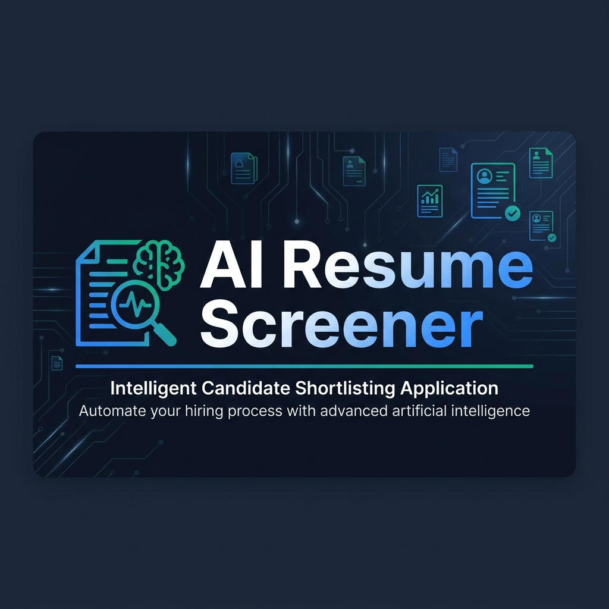

<p align="center">
  
</p>

<h1 align="center">🤖 AI-Powered Resume Screening & Skill Gap Analyzer</h1>

<p align="center">
  <em>Automate candidate pre-screening, ranking, and skill gap identification using NLP & Machine Learning</em>
</p>

<p align="center">
  
  
  
  
  
</p>

---

## 📌 Problem Statement

Recruiters spend an average of **6–7 seconds** reviewing a single resume, making manual screening error-prone, biased, and time-consuming. For organizations receiving hundreds or thousands of applications per role, this becomes a significant bottleneck in the hiring pipeline.

**This project solves the problem by:**
- Automating PDF resume parsing and text extraction
- Using NLP techniques (TF-IDF, tokenization, lemmatization) for semantic matching
- Training ML classifiers to predict shortlisting probability
- Identifying skill gaps and recommending targeted learning resources
- Providing transparent, explainable predictions through SHAP

---

## ✨ Features

| Feature | Description |
|---------|-------------|
| 📄 **Smart PDF Parsing** | Extracts and cleans text from multi-page PDF resumes with error-tolerant processing |
| 🧠 **NLP Preprocessing** | Tokenization, stopword removal, and lemmatization using NLTK |
| 🎯 **Hybrid Scoring Engine** | TF-IDF cosine similarity (50%) + skill overlap (40%) + experience fit (10%) |
| 🤖 **ML Classification** | Logistic Regression, Random Forest, and XGBoost with automated model selection |
| 📊 **Interactive Dashboard** | Plotly-powered analytics with bar charts, scatter plots, and pie charts |
| 🔍 **Skill Gap Analysis** | Identifies missing skills with curated learning roadmaps and course recommendations |
| 🧪 **SHAP Explainability** | Feature-level explanations for every prediction — full transparency |
| 🏆 **Candidate Leaderboard** | Ranked comparison table with match scores, skill metrics, and recommendations |
| 🎨 **Premium Dark UI** | Professional recruiter dashboard with glassmorphic cards and gradient animations |

---

## 🛠 Tech Stack

| Category | Technologies |
|----------|-------------|
| **Language** | Python 3.10+ |
| **Web Framework** | Streamlit |
| **NLP** | NLTK (tokenization, lemmatization, stopwords) |
| **ML Models** | Scikit-Learn (Logistic Regression, Random Forest), XGBoost |
| **Explainability** | SHAP (SHapley Additive exPlanations) |
| **Visualization** | Plotly, Matplotlib |
| **PDF Processing** | pypdf |
| **Data Processing** | Pandas, NumPy |
| **PDF Generation** | ReportLab (for mock resumes) |

---

## 🏗 Project Architecture

```
┌─────────────────────────────────────────────────────────────────┐
│                        USER INTERFACE                           │
│                   Streamlit Dashboard (app.py)                  │
├─────────────┬─────────────┬──────────────┬──────────────────────┤
│  Job Desc   │   Resume    │   Ranking    │     Analytics        │
│   Input     │   Upload    │  Leaderboard │   & SHAP             │
├─────────────┴─────────────┴──────────────┴──────────────────────┤
│                      PROCESSING PIPELINE                        │
│                                                                 │
│  ┌──────────┐  ┌──────────┐  ┌───────────┐  ┌───────────────┐  │
│  │ PDF      │→ │ NLP      │→ │ Skill &   │→ │ Hybrid Score  │  │
│  │ Parser   │  │ Preproc  │  │ Exp Extract│  │ Calculator    │  │
│  └──────────┘  └──────────┘  └───────────┘  └───────────────┘  │
│                                                                 │
│  ┌──────────────────────┐  ┌────────────────────────────────┐   │
│  │ ML Classifier        │→ │ SHAP Explainer                 │   │
│  │ (LR / RF / XGBoost)  │  │ (Feature Importance per sample)│   │
│  └──────────────────────┘  └────────────────────────────────┘   │
├─────────────────────────────────────────────────────────────────┤
│                        DATA LAYER                               │
│  candidates.csv │ X_train.csv │ *.joblib models │ resumes/*.pdf │
└─────────────────────────────────────────────────────────────────┘
```

### Pipeline Flow

1. **PDF Parsing** → Extract raw text from uploaded PDF resumes using `pypdf`
2. **NLP Preprocessing** → Normalize, tokenize, remove stopwords, and lemmatize with `NLTK`
3. **Skill & Experience Extraction** → Regex + word-boundary matching across 17 predefined tech skills
4. **Hybrid Score Matching** → TF-IDF cosine similarity + skill overlap ratio + experience fit
5. **ML Classification** → Predict shortlist probability using the best-performing classifier
6. **SHAP Explainability** → Visualize per-feature contribution to each prediction

---

## 📂 Project Structure

```
Resume_Screening_System/
│
├── app.py                      # Main Streamlit dashboard application
├── data_generator.py           # Synthetic data & mock resume generator
├── requirements.txt            # Python dependencies
├── LICENSE                     # MIT License
├── README.md                   # Project documentation
│
├── utils/                      # Core processing modules
│   ├── pdf_parser.py           # PDF text extraction
│   ├── text_preprocessing.py   # NLP preprocessing pipeline
│   ├── skill_extractor.py      # Skill matching & gap analysis
│   ├── matcher.py              # TF-IDF similarity & hybrid scoring
│   └── ml_model.py             # ML training, evaluation & SHAP
│
├── data/                       # Training data & job descriptions
│   ├── candidates.csv          # Synthetic training dataset (300 rows)
│   ├── jd_ml_engineer.txt      # Sample JD: ML Engineer
│   └── jd_web_developer.txt    # Sample JD: Full-Stack Developer
│
├── models/                     # Trained ML models (generated)
│   ├── best_model.joblib       # Best performing model
│   ├── best_model_name.txt     # Name of best model
│   ├── model_comparison.csv    # Evaluation metrics comparison
│   ├── X_train.csv             # Training features for SHAP
│   ├── logistic_regression_model.joblib
│   ├── random_forest_model.joblib
│   └── xgboost_model.joblib
│
├── resumes/                    # Sample PDF resumes (generated)
│   ├── alex_carter_ml_engineer.pdf
│   ├── sarah_jenkins_frontend.pdf
│   ├── michael_chang_devops.pdf
│   ├── emily_watson_backend.pdf
│   ├── john_doe_intern.pdf
│   └── david_miller_ml_junior.pdf
│
├── assets/                     # Project assets
│   └── banner.png              # GitHub README banner
│
└── docs/                       # Additional documentation
    └── ARCHITECTURE.md         # Detailed architecture notes
```

---

## 🚀 Installation & Setup

### Prerequisites
- Python 3.10 or higher
- pip (Python package manager)

### Step 1: Clone the Repository
```bash
git clone https://github.com/<your-username>/Resume-Screening-System.git
cd Resume-Screening-System
```

### Step 2: Create a Virtual Environment
```bash
python -m venv venv
source venv/bin/activate        # Linux/macOS
venv\Scripts\activate           # Windows
```

### Step 3: Install Dependencies
```bash
pip install -r requirements.txt
```

### Step 4: Generate Training Data & Train Models
```bash
python data_generator.py
```
This will:
- Generate a synthetic dataset of 300 candidates (`data/candidates.csv`)
- Create 6 mock PDF resumes in `resumes/`
- Train Logistic Regression, Random Forest, and XGBoost classifiers
- Save the best model and evaluation metrics in `models/`

### Step 5: Download NLTK Resources (auto-handled)
NLTK resources are downloaded automatically on first run. If you're behind a firewall:
```bash
python -c "import nltk; nltk.download('stopwords'); nltk.download('punkt'); nltk.download('wordnet'); nltk.download('omw-1.4')"
```

### Step 6: Launch the Application
```bash
streamlit run app.py
```

The app will open at **http://localhost:8501** 🎉

---

## 📖 Usage Guide

### 1️⃣ Configure Job Description
Navigate to **Job Description Input** → Select a template or paste custom text → Click **Analyze & Save**

### 2️⃣ Upload Resumes
Go to **Resume Upload** → Select mock resumes or upload your own PDFs → Click **Process & Screen**

### 3️⃣ View Rankings
Open **Resume Ranking** → See the candidate leaderboard sorted by match score with ML recommendations

### 4️⃣ Analyze Skill Gaps
Navigate to **Skill Gap Analysis** → Select a candidate → View matching/missing skills and learning roadmap

### 5️⃣ Explore Analytics
Open **Analytics Dashboard** → Explore interactive Plotly charts, model comparison metrics, and SHAP explanations

---

## 📸 Screenshots

<details>
<summary><b>🏠 Home Page — Project Overview & Architecture</b></summary>
<br>
<em>The home page showcases the project overview, architecture pipeline, key features, and quick start guide with a premium dark theme design.</em>
</details>

<details>
<summary><b>📋 Job Description Input — Criteria Configuration</b></summary>
<br>
<em>Configure job requirements with template selection, automatic skill extraction, and experience level detection.</em>
</details>

<details>
<summary><b>📄 Resume Upload — PDF Processing Pipeline</b></summary>
<br>
<em>Upload PDFs via drag-and-drop or select mock resumes. View real-time processing progress and extracted text previews.</em>
</details>

<details>
<summary><b>🏆 Resume Ranking — Candidate Leaderboard</b></summary>
<br>
<em>Comprehensive candidate comparison table with match scores, skill metrics, experience, and ML-based shortlisting recommendations.</em>
</details>

<details>
<summary><b>🔍 Skill Gap Analysis — Missing Skills & Learning Roadmap</b></summary>
<br>
<em>Per-candidate breakdown showing matching skills, missing skills, and curated learning resources for skill improvement.</em>
</details>

<details>
<summary><b>📊 Analytics Dashboard — Charts & SHAP Explainability</b></summary>
<br>
<em>Interactive Plotly visualizations, model performance comparison, and SHAP waterfall plots for prediction transparency.</em>
</details>

---

## 🔮 Future Enhancements

- [ ] **Multi-language Resume Support** — Parse resumes in Hindi, Spanish, French, etc.
- [ ] **Fine-tuned BERT/LLM Embeddings** — Replace TF-IDF with transformer-based embeddings for deeper semantic matching
- [ ] **ATS Score Simulation** — Generate an Applicant Tracking System compatibility score
- [ ] **Batch Processing API** — REST API endpoint for bulk resume screening
- [ ] **Database Integration** — PostgreSQL/MongoDB for persistent candidate storage
- [ ] **Email Notifications** — Auto-notify shortlisted candidates
- [ ] **Advanced Visualization** — Radar charts, heatmaps, and comparative skill matrices
- [ ] **Resume Builder Suggestions** — AI-powered resume improvement recommendations
- [ ] **Dockerized Deployment** — One-command Docker deployment with `docker-compose`
- [ ] **Cloud Deployment** — AWS/GCP/Azure deployment with CI/CD pipeline

---

## 📄 License

This project is licensed under the **MIT License** — see the [LICENSE](LICENSE) file for details.

---

## 👤 Author

**Your Name**

- 🔗 GitHub: [@your-username](https://github.com/your-username)
- 💼 LinkedIn: [your-profile](https://linkedin.com/in/your-profile)
- 📧 Email: your.email@example.com

> *Built with ❤️ as a portfolio project for ML internship applications and the Amazon ML Summer School.*

---

<p align="center">
  <b>⭐ If you found this project helpful, please consider giving it a star!</b>
</p>
